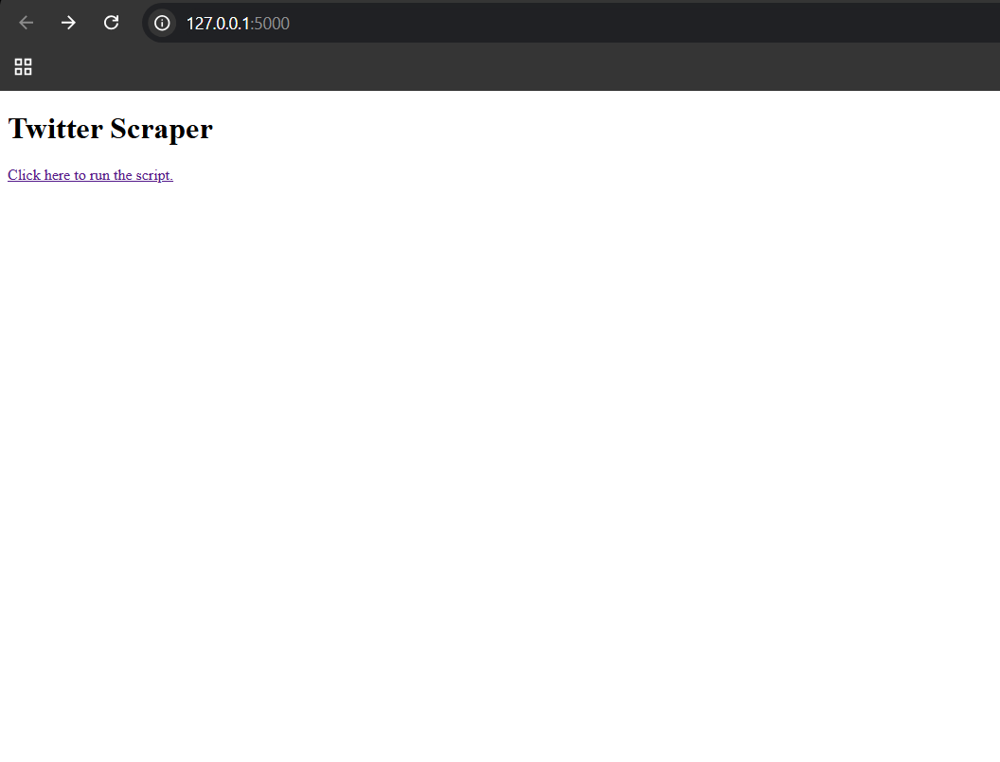
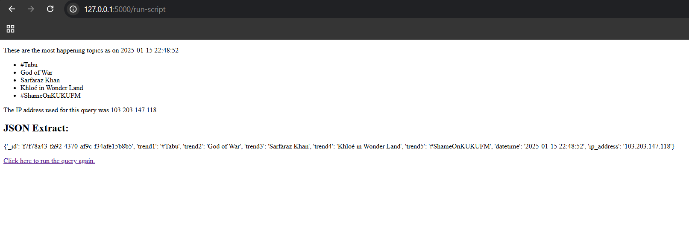
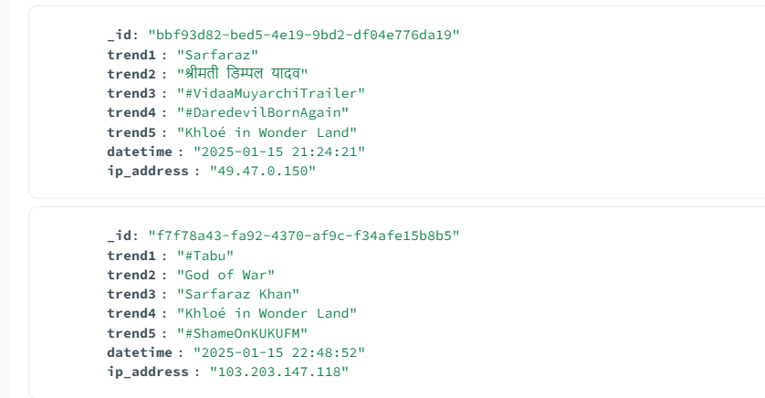

# Twitter (X) Trending Topics Scraper

This project scrapes trending topics from Twitter (X) and stores them in a MongoDB database. The scraper fetches the top 5 trending topics, records the time of scraping, and the IP address used for the request, ensuring each request uses a different IP address via ProxyMesh.

### Features:
- Scrapes the top 5 trending topics from Twitter (X).
- Excludes irrelevant or unwanted topics based on specific filters.
- Uses ProxyMesh to send requests from a different IP address each time.
- Stores the scraped data in MongoDB with a unique ID for each scraping session.
- Displays the results on a simple HTML page.

### Tech Stack:
- **Python**
  - Selenium for web scraping
  - Flask for serving the results
  - PyMongo for interacting with MongoDB
  - Requests for obtaining the public IP address
- **MongoDB** for storing scraped data
- **ProxyMesh** for rotating IP addresses

---

## Installation and Setup

### Prerequisites:
1. Python 3.x installed on your machine.
2. MongoDB instance running locally or remotely (if local, ensure MongoDB is installed).
3. A **ProxyMesh** account (for IP rotation).
4. A Twitter (X) account.

## Images

### Before Scraping

### After Scraping

### MongoDB View

